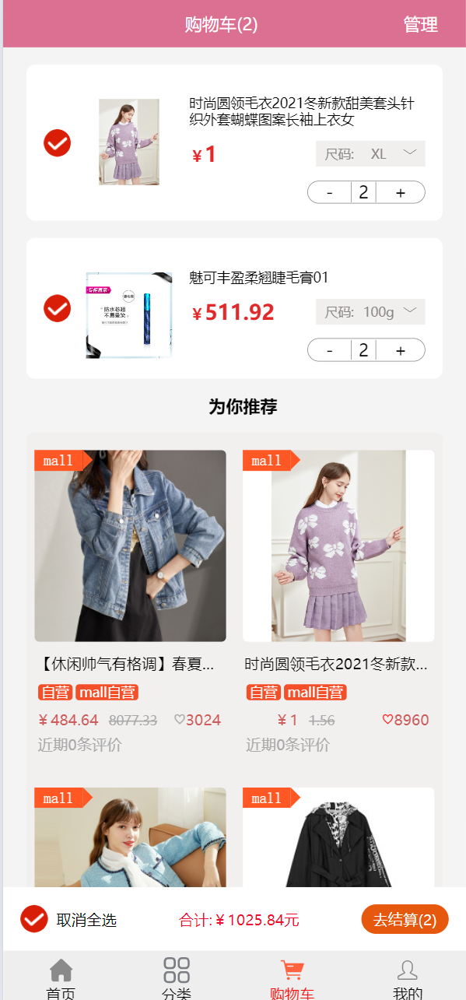

# mall

#### 介绍
mall是关于商城的一个项目，该项目中具有前端（web）、后端（server）以及后台管理（admin）三个子项目，分别对应了商城页面、商城接口以及商城后台管理。
该项目实现了商品的详情、收藏、加入购物车、购物车的管理，目前已对接了支付宝沙盒环境支付，可以使用qq邮箱进行注册账号，商城后台可以对商品进行管理，如：上下架、编辑、删除、添加、轮播图管理、数据统计
#### 项目目录结构
1. [web目录结构](./web/directoryList.md)
2. [server目录结构](./server/directoryList.md)
3. [admin目录结构](./admin/directoryList.md)

#### 安装教程

1. 复制项目地址
2. 克隆项目

#### 使用说明

1. web(前端)
* 1.1 通过终端进入项目中的 &nbsp; web&nbsp; 文件夹
* 1.2 执行npm install命令安装项目依赖
* 1.3 执行npm run serve命令启动项目

2. server(后端node)
* 2.1 通过终端进入项目中的 &nbsp; server&nbsp; 文件夹
* 2.2 执行npm install命令安装项目依赖
* 2.3 执行npm run serve命令启动项目

3. admin(后台管理)
* 3.1 通过终端进入项目中的 &nbsp; admin&nbsp; 文件夹
* 3.2 执行npm install命令安装项目依赖
* 3.3 执行npm run vite命令启动项目

#### 参与贡献

1.  Fork 本仓库
2.  新建 Feat_xxx 分支
3.  提交代码
4.  新建 Pull Request


#### 技术栈

1. 前端（web）：
 <span style="margin:.5rem 0;display:inline-block;padding:.5rem;background-color: #4158D0; background-image: linear-gradient(43deg, #4158D0 0%, #C850C0 46%, #FFCC70 100%); color:#fff;font-weight:bold;text-decoration: underline;">vue2 + vue-router + vuex + socket.io-client</span>
2. 后端（server）：
 <span style="margin:.5rem 0;display:inline-block;padding:.5rem;background-color: #85FFBD;background-image: linear-gradient(45deg, #85FFBD 0%, #FFFB7D 100%);color:blue;font-weight:bold;text-decoration: underline;">node + express + mysql + mongoose + nodemailer + socket.io + Alipay</span>
3. 后台管理（admin）：
 <span style="margin:.5rem 0;display:inline-block;padding:.5rem;background-color: #FA8BFF; background-image: linear-gradient(135deg, #FA8BFF 0%, #2BD2FF 52%, #2BFF88 90%); color:yellow;font-weight:bold;text-decoration: underline;">vue3 + vue-router + pinia + Element-plus + Echart</span>

#### 项目预览图
1. <h6 style="color:orange">商城预览图</h6>
   <div style="display: flex;flex-wrap: wrap;justify-content: flex-start;align-items: center;">
    
    
    
    
    
    
    
    
    
    
    
    
    
   </div>

2. <h6 style="color:orange">商城后台管理预览图</h6>
  <div >
    
    
    
    
    
    
    
    
    
   </div>

#### 项目中遇到的问题

##### 一、使用mysql一次执行多条语句
```javascript
const selectOne = mysql_query.selectAll('mall_goods',`product_id = '${query.product_id}' AND sell_type = '${query.product_type}'`)
const selectTwo = mysql_query.selectFields('mall_goods_attribute','attribute_title,attribute',`product_id = '${query.product_id}'`)

connection.query(`${selectOne+';'+selectTwo}`,(err,results) =>{
    if (err) throw err
    else{
        console.log(results)
    }
})
```

##### 二、组件强制重新渲染
###### 场景：项目中多处使用了ProductSize组件，在某一ProductSize组件中进行了尺寸选择操作，想让ProductSize其他组件的选择也跟着变化
###### 问题：其他组件选择项无变化
###### 原因：组件没有重新渲染，无法显示最新操作
###### 推荐做法：改变该组件所绑定的key值，vue会根据组件中key值是否变化来进行组件的渲染

```vue

<template>
  <product-size :key="productSizeKey"></product-size>
</template>
<script>
import ProductSize from "./ProductSize";

export default {
  data() {
    return {
      productSizeKey: 0
    }
  },
  components:{
    ProductSize
  },
  methods: {
    closeAddCart() {
      //触发该方法后改变productSizeKey的值，达到组件重新渲染的目的
      this.productSizeKey += 1
    }
  }
}
</script>
```

##### 三、vue-router路由传参刷新页面后参数丢失
###### 解决：使用query传参
###### 缺点：url过长，会被用户看到参数
```vue
<tempalte>
<ul class="swiper-list">
  <li v-for="(item, index) in banner" v-show="index===mark" :key="index">
    <router-link :to="{name:'bannerDetail',query:{brand_id:item.brand_id,brand:item.brand,banner_image:item.banner_image}}" class="item">
      
    </router-link>
  </li>
</ul>
</tempalte>

```

##### 四、事件总线中的事件被多次触发($bus)
###### 解决：在组件销毁前手动注销该事件(beforeDestroy)
###### 原因：事件总线是全局的，它不会随着组件的销毁而注销，每次切换路由时，事件的执行次数就会加一，需要手动注销
```vue
<script >
  export default ({
    beforeDestroy() {
      this.$bus.$off('需要注销的事件名')
    }
  })
</script>
```

##### 五、在better-scroll组件中嵌套原生滚动组件后，只能触发better-scroll的滚动，无法触发原生滚动组件的滚动
###### 解决：在使用了原生滚动组件内添阻止事件冒泡
###### 原因：在better-scroll组件中嵌套其他组件，触发事件时，只能触发到better-scroll的事件，并没有触发原生组件事件

```vue
<template>
  <div class="sale-list" ref="sale">
    <ul ref="saleUl">
      <li ref="saleLi" class="sale-list-item" v-for="(item,index) in flashSaleData" :key="index" @touchStart="toMoreSale">
        <button @click="toMoreSale(item.product_id)" class="sale-image"></button>
        
        <span class="sale-price">{{'￥'+ item['price']}}</span>
      </li>
    </ul>
  </div>
</template>
<script >
  export default ({
    mounted() {
      //解决better-scroll中嵌套原生滚动组件时，原生组件无法滚动的问题（办法：在原生组件中添加触摸事件，阻止触摸事件的冒泡）
      this.$refs.saleUl.addEventListener('touchstart',(e)=>{
        e.stopPropagation()
      });
    },
  })
</script>
```

##### 六、在better-scroll嵌套的原生滚动组件内添加了阻止事件冒泡方法后，原生组件可以横向滚动了，但原生组件内的click方法无法执行，
###### 解决：1.只使用touch或者只使用click 2.将需要点击的元素换成button元素，并使用其click方式进行点击
###### 原因：touch事件与click事件冲突

```vue
<template>
  <div class="sale-list" ref="sale">
    <ul ref="saleUl">
      <li ref="saleLi" class="sale-list-item" v-for="(item,index) in flashSaleData" :key="index" @touchStart="toMoreSale">
        <button @click="toMoreSale(item.product_id)" class="sale-image"></button>
        
        <span class="sale-price">{{'￥'+ item['price']}}</span>
      </li>
    </ul>
  </div>
</template>
```
##### 七、使用自定义指令给页面添加数据加载效果（转圈圈）
###### 步骤：
1. 创建转圈圈组件。
2. 将组件加入到App.vue中。 
3. 在main.js文件中注册全局指令
```javascript
//全局注册自定义指令
Vue.directive('loading',{
  //bind钩子函数在参数改变时无法作出相应变化，需使用update或者componentUpdated钩子函数
  update(el,binding){
    console.log(binding.value)
    if (binding.value === true){
      el.style.display = 'block'
    }
    else{
      el.style.display = 'none'
    }
  }
})
```
##### 八、node中使用mysql多表联查时报错("Column 'user_id' in field list is ambiguous")(user_id列在字段列表中存在歧义、模棱两可)
###### 原因：出现该错误的原因是在使用多表联查时，两个表中的字段列表中都含有user_id字段，在查询的结果字段中又包含user_id字段，mysql不知道你需要显示的是哪个表中的user_id字段
###### 错误的sql语句
```javascript
//查询的user_id字段不明确，应该指明是mall_store_order别名（O）表中的或者mall_user别名（U）表中的user_id字段
const selectQuery = `SELECT user_id,account,username,total_price FROM mall_store_order as O INNER JOIN mall_user as U ON O.user_id = U.user_id and O.payment_status = 2`
```
###### 正确的sql语句
```javascript
const selectQuery = `SELECT O.user_id,account,username,total_price FROM mall_store_order as O INNER JOIN mall_user as U ON O.user_id = U.user_id and O.payment_status = 2`
```

##### 九、vue3中全局挂载自定义插件（install）
###### 实现步骤：
1. 创建自己的组件(Toast.vue)
```vue
<template>
  <div></div>
</template>

<script lang="ts">
import { defineComponent,reactive } from "vue"
export default defineComponent( {
  name: "Toast",
  setup(){
    let toast = reactive({})

    const showToast = ()=>{}
    
    const know = ()=>{}

    return {
        toast,
        showToast,
        know
    }
  }
})
</script>

<style scoped>
/* 组件样式 */
</style>
```

2. 创建一个ts文件(toast.ts)
```typescript
import Toast from "./Toast.vue";
import { createApp } from "vue";

export default {
    install(app:any){

        //创建应用实例
        const application = createApp(Toast)

        //将实例挂载到div上
        const appEl = application.mount(
            document.createElement('div')
        )

        //将挂载有实例的盒子加入到body中
        document.body.appendChild(appEl.$el)

        //含有方法的对象
        const PUBLIC_FUN = {
            showToast(message:string,duration:number,title:string){
                // @ts-ignore
                appEl.showToast(message,duration,title)
            }
        }

        //将对象挂载为app的全局属性
        app.config.globalProperties.$toast = PUBLIC_FUN
    }
}
```

3. 在main.ts中安装插件(main.ts)
```typescript
import { createApp } from 'vue'
import App from './App.vue'
import toast from "./components/common/toast";

const app = createApp(App)

//安装自定义插件
app.use(toast)

app.mount('#app')
```

##### 十、在vue3项目中使用事件总线$bus(mitt)
###### 实现步骤：
1. 安装mitt
```
npm install mitt --save
```

2. 在main.ts文件中引入mitt
```typescript
import { createApp } from 'vue'
import App from './App.vue'
import mitt from "mitt";

const app = createApp(App)

//将事件总线注册为全局属性
app.config.globalProperties.$bus = mitt()

app.mount('#app')

```

3. 使用
```vue
<template>
  <el-button class="confirm-button" size="small" type="success" @click="confirmAdd">确定</el-button>
</template>

<script lang="ts">
import {defineComponent, reactive,getCurrentInstance,ComponentInternalInstance} from "vue";

export default defineComponent({
  name: "AddSeckill",
  setup(props,context){
    const {appContext} = getCurrentInstance() as ComponentInternalInstance

    const confirmAdd = ()=>{
      appContext.config.globalProperties.$bus.emit('事件名称',{'data':''})
    }

    return {
      confirmAdd
    }
  }
})
</script>

<style scoped></style>

```

##### 十一、vue3项目中如何实现与vue2一样的mixins混入效果（使用vue3的组合式API  CompositionApi）
###### 实现步骤：
1. 创建一个ts文件
```typescript
//利用CompositionApi实现类似vue2的mixins混入效果
import { reactive , watchEffect } from "vue";

export default function (size:number) {
  let table = reactive({
     pageSize:<number>size
  })

  
  const currentPageChange = (val:number)=>{}

  const sliceTableData = (start:number,end:number)=>{}

  watchEffect(()=>{})

  return {
    table,
    currentPageChange,
    sliceTableData
  }
}
```

2. 使用
```vue
<script lang="ts">
import { defineComponent} from "vue";
import useTable from '../../../common/useTable'

export default defineComponent({
  setup(props){
    const {table,currentPageChange} = useTable(6)
  }
</script> 
```

##### 十二、后台管理项目打包时出现element-plus找不到module的报错（node_modules/element-plus/lib/components/table/index.d.ts:235:27 - error TS2307: Cannot find module './src/table/defaults' or its corresponding type declarations.）
###### 三种解决方案：
1. 在项目的tsconfig.json文件中添加skipLibCheck:true属性
```json
{
  "compilerOptions": {
    "skipLibCheck": true 
  }
}
```

2. 在项目的package.json文件中修改打包指令（将build中的vue-tsc --noEmit && vite build 修改为 vue-tsc --noEmit --skipLibCheck && vite build）
```json
{
  "scripts": {
    "build": "vue-tsc --noEmit --skipLibCheck && vite build"
  }
}

```
3. 在项目的package.json文件中的打包指令删除打包时肩型ts检测的指令（删除vue-tsc --noEmit --skipLibCheck && ）
```json
{
  "scripts": {
    "build": "vite build"
  }
}
```

##### 十三、将server文件夹中的文件打包成.exe执行程序（启动服务可以直接点击执行程序启动，不需要手动输入启动五福指令）
###### 步骤：
1. 全局安装pkg
```text
npm install pkg -g
```
2. 执行打包指令
```text
pkg app.js
```
3. 在电脑的项目中找到打包好的.exe文件双击启动就可以了


##### 十四、在vue2中使用vue-lazyload实现图片的懒加载，报错 failed to resolve directive:lazy
###### 原因：版本问题     解决：本项目安装的是@1.3.3版本不会报错
    1. npm 安装依赖
```text
npm install vue-lazyload@1.3.3 --save
```
    2. 安装插件
```javascript
import VueLazyload from "vue-lazyload";
Vue.use(VueLazyload)
```
    3. 在图片标签中使用v-lazy指令
```vue

```


